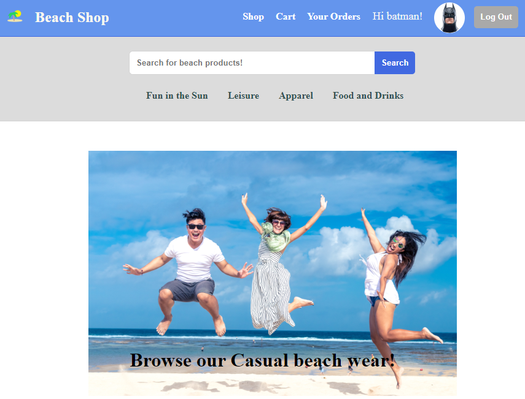
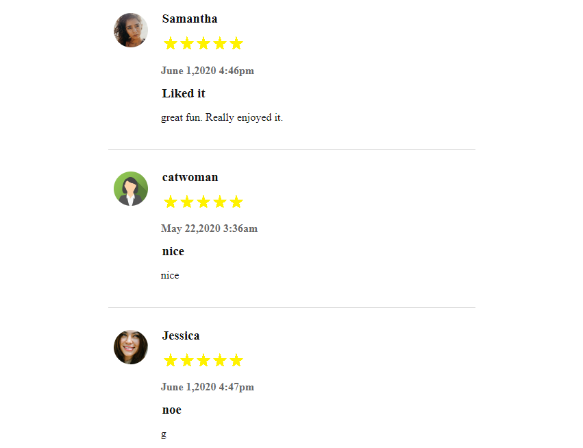

# BeachShop

[Video Demonstration](https://m.youtube.com/watch?v=YGa59yo1Z0k)

## What the app does

Beach Shop is an online website where users can browse different beach products one might need for a day at the beach. 

Users can add or remove products from thier cart. They can search for specific products or click on general product categories and sort the results by rating or price. Once a user has finished shopping  they can proceed to checkout and generate an order. Users can leave reviews on products they purchased and leave a rating from one to five stars.

The Beach Shop was inspired by Amazon. It was made with React, Rails and jBuilder. 

## Setting up the Search Bar

One of the first main challanges I came across with the Beach Shop was in setting up the search bar and the search results. I wanted to ensure that the search bar was always present, yet I wanted the bottom half of the page to either show the search results or whatever url the user is currently viewing. 

Looking back on it the solution was alot simpler than I first perceived it to be. Instead of having the search results to be based on state passed from the SearchBar component, I had the search bar place the search term into the redux store and push the history to go to the search results. Once the Search Results Container is rendered it quickly selects the products by search term. The search results are in a switch statement as well as the  product details, orders, cart and profile routes and so will only render if the url is directed there.

## Reducing database calls

I tried to minimize database calls until they were absolutely necessary. Instead of fetching a particular product's information and doing another fetch for it's reviews I used jBuilder to pull down the reviews in the single product fetch.

The other components that use the product information will also only fetch all the products if they are not found in the store  making for a faster website experience.

## Future Directions

- Integrating a system that securely allows a user to save a credit card on file.

- To adjust the product's detail page to show multiple images of a product and allowing a user to view the product in different colors and sizes.

- To integrate an algorithim to display products based on a user's previous website activity.

 	
